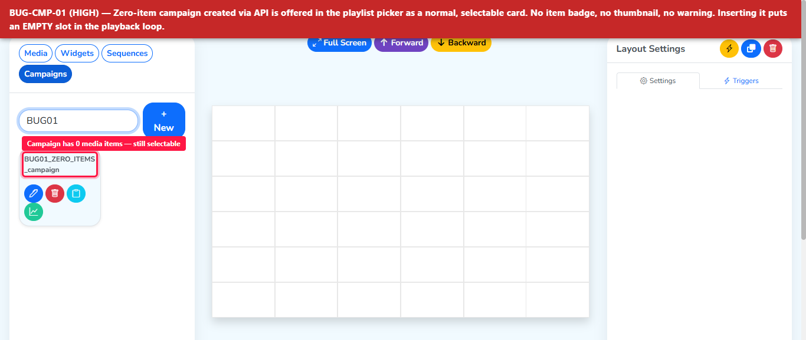
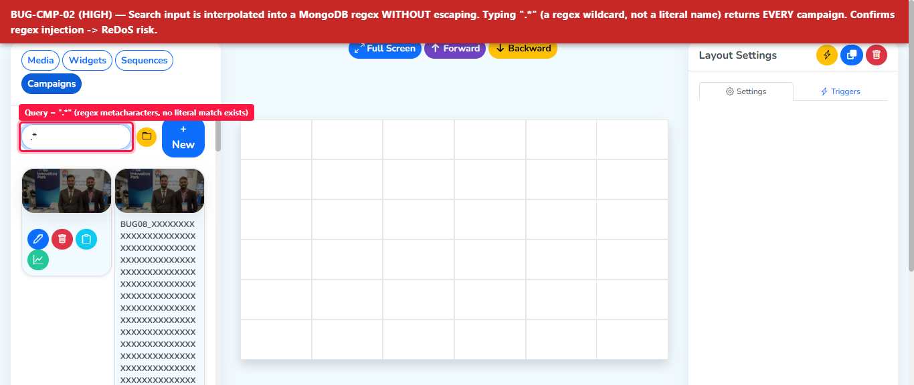
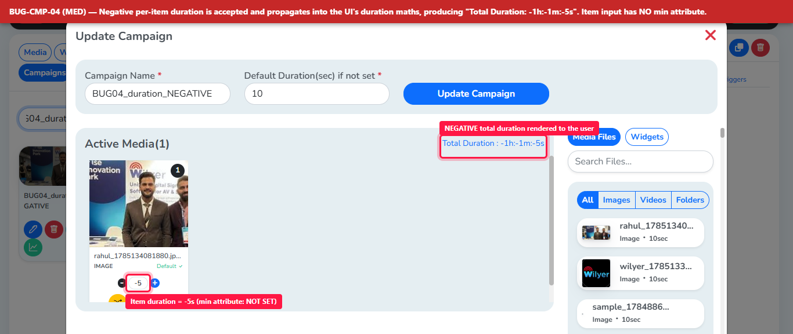
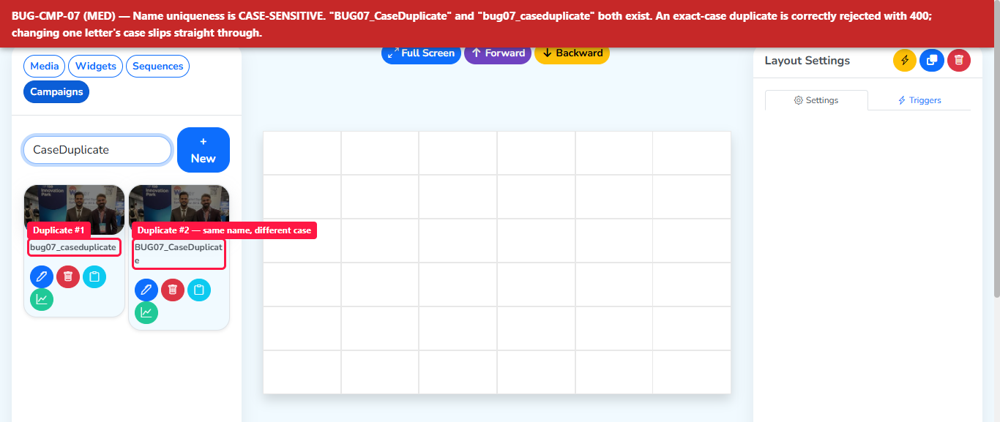
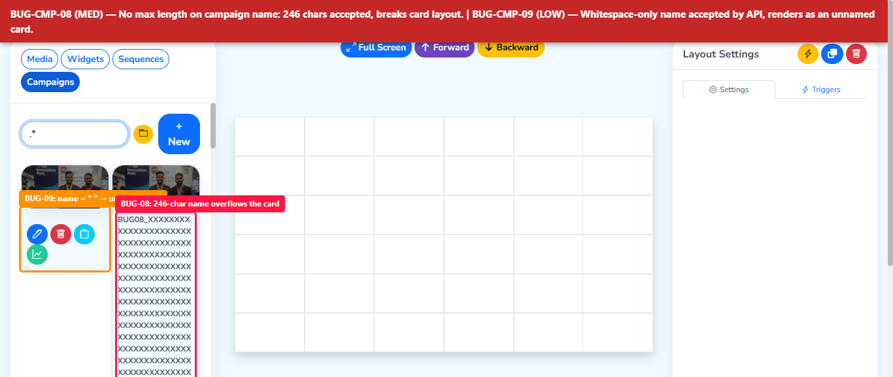
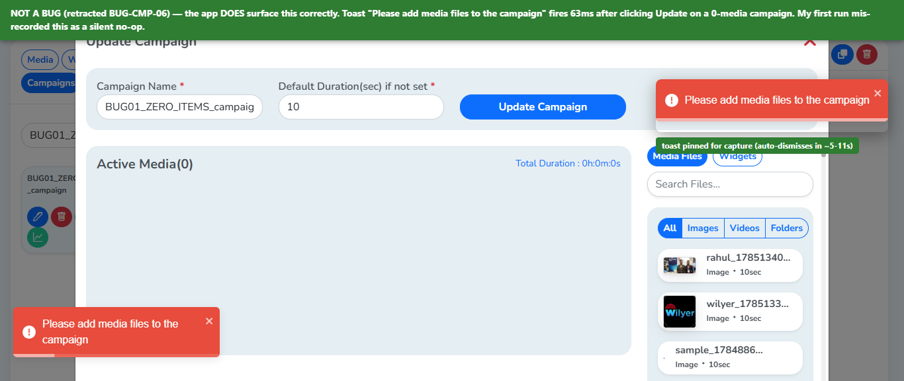

# Campaigns V1 — CRUD, Boundary & Search Test Run (Executed)

**Document ID:** CMP-QA-DOC-10
**Type:** Executed test run (not a plan)
**Environment:** `https://cms2.pocsample.in` (branch `cms2`) · API `https://v3-5api2.pocsample.in/v3/cms`
**Account:** dev@wilyer.com (admin, `isCampaignEnabled: true`)
**Date:** 2026-07-28
**Scope:** Campaign CRUD + boundary values + search, exercised through the **playlist editor** picker
**Method:** UI-driven via Playwright, each result confirmed at the API layer (a UI check alone proves nothing — see Doc 06 §7.2)

---

## Executive summary

**10 defects confirmed — 2 High, 4 Medium, 4 Low.** No Critical.
**2 findings retracted** after re-testing with proper instrumentation (see §Retractions).

The dominant pattern: **validation lives in the browser, not on the server.** Every boundary the
UI blocks, the API accepts. Anything that talks to the API directly — a script, a retry, a future
mobile client, or a user with the request copied out of devtools — bypasses the rules entirely.

Two defects were **predicted in advance** in Doc 09 §22 and are now confirmed:
prediction #9 (empty campaign publishable) and prediction #20 (duration floor bypass, the same
bug already known in playlist duration).

---

## Feature facts established

| Item | Value |
|------|-------|
| Campaigns location | Playlist editor → picker tab 4 (`Media / Widgets / Sequences / Campaigns`). **No sidebar entry** |
| Feature flag | JWT claim `isCampaignEnabled: true` — per-account gating confirmed |
| Create payload | `{ data: [{ file, duration }], defaultDuration, name, folderId }` |
| List | `GET /campaign/read?limit&page&sort&order&search&folderId` → `{docs, totalDocs, totalPages, page, hasNextPage, …}` |
| Read one | `GET /campaign/read/{id}` |
| Create | `POST /campaign/create` |
| Update | `POST /campaign/update/{id}` (POST, not PUT/PATCH) |
| Delete | `DELETE /campaign/delete/{id}` — hard delete, count drops immediately |
| Read shape | `{ id, name, folderId, data[] }` — **`defaultDuration` is not returned** |
| Card actions | edit · delete · duplicate · report (`/campaign-report/{id}`) |
| Campaigns present | 23 pre-existing on cms2 |

**Doc 01 corrections this run forces:**
- AS-05 (soft delete) is **wrong** — delete appears to be hard. `totalDocs` went 34 → 23 with no
  recoverable state exposed. Doc 07 §14 DB-011/012 must be rewritten.
- AS-10 (endpoint naming) is **confirmed** except Update uses `POST`, not `PUT`/`PATCH`.
  Doc 08 §19.5 `apiProbe` regexes are correct as written.

---

## Defects

### BUG-CMP-01 · Zero-item campaign accepted by the API — High / S1



`POST /campaign/create` with `data: []` → **200 `{"message":"Campaign created successfully."}`**

The UI blocks this. The server does not. The resulting campaign then appears in the playlist
picker as a **normal, selectable card** — no badge, no thumbnail, no "empty" warning — and can be
inserted into a loop.

Violates BR-04. A campaign slot resolving to nothing is a blank frame on a customer screen, and
the loop-position arithmetic (`(loop-1) % length`) divides by zero on an empty list.

Compounding: once created, the campaign **cannot be saved from the UI** at all — Update is
client-blocked while media count is 0 (correctly, with a toast). The record can only be fixed by
adding media, or deleted. Nothing in the picker warns a user before they insert it into a loop.

**Fix:** enforce `data.length >= 1` server-side on create *and* update. Add a `hasMedia` guard in
the picker and at publish time.

---

### BUG-CMP-02 · Regex injection in campaign search — High / S2



The `search` parameter is interpolated into a MongoDB regex **without escaping**. Proven with four
independent metacharacter classes:

| Query | Result | Proves |
|-------|--------|--------|
| `QA_Dur_Zero` | 1 (control) | literal baseline |
| `QA_Dur_Zer.` | 1 | `.` is a live wildcard |
| `Q{2,}` | 1 | quantifiers evaluate |
| `(QA\|rtgv)` | 8 | alternation groups evaluate |
| `.*` | **34 (everything)** | full-collection match via metachar |
| `^QA` | 7 | anchors evaluate |

**Consequences:**
1. **ReDoS** — a crafted catastrophic-backtracking pattern can pin database CPU. *Not exploited:
   this is a shared test server. Flagged for a controlled test in an isolated environment.*
2. Users whose campaign names contain `.` `(` `)` `[` `+` `*` `?` get wrong search results.
3. Once folder restrictions ship, an unescaped `.*` is a candidate for enumerating names the
   user should not see — **retest this the moment RBAC lands** (Doc 06 §7.2).

**Fix:** escape the input before regex construction, or switch to a text index.

---

### BUG-CMP-03 · `GET /campaign/read` returns 500 when `sort`/`order` are omitted — Medium / S2

```
?limit=50&page=1&search=X&folderId=      → 500
?limit=50&page=1&sort=createdAt&order=-1&search=X&folderId=  → 200
```

Optional-looking query parameters are mandatory, and their absence produces a server error rather
than a `400` or a sensible default. Any client not replicating the UI's exact query string breaks.

**Fix:** default `sort=createdAt`, `order=-1`; return 400 on genuinely invalid values.

---

### BUG-CMP-04 · Item duration accepts 0 and negative values — Medium / S2



The negative value propagates into the editor's own arithmetic: the dialog displays
**`Total Duration : -1h:-1m:-5s`**.

| Path | Input | Result |
|------|-------|--------|
| API create | `duration: 0` | 200, persisted |
| API create | `duration: -5` | 200, persisted |
| API create | `defaultDuration: 0` | 200, persisted |
| **UI update** | item duration `0` | **200, persisted** — verified end-to-end |

The per-item duration `<input type="number">` carries **no `min` attribute** (the Default Duration
field correctly has `min="1"`). Violates BR-13.

This is the **same defect class already known in playlist duration** (`playlist-duration.spec.ts`,
memory note: stepper floor is 1 but typing bypasses it). It has been reimplemented in campaigns.

**Fix:** `min=1` on the item input, and server-side `duration >= 1` validation. A negative duration
in a loop is undefined behaviour on the player.

---

### ~~BUG-CMP-05~~ · RETRACTED — errors *are* surfaced

### ~~BUG-CMP-06~~ · RETRACTED — client-side blocks *are* explained

Both are **false positives from my first pass.** See §Retractions below. The application handles
both cases correctly.

---

### BUG-CMP-07 · Name uniqueness is case-sensitive — Medium / S3



| Existing | Attempt | Result |
|----------|---------|--------|
| `QA_Boundary_ZeroItems` | `QA_Boundary_ZeroItems` | 400 — correct |
| `QA_Boundary_ZeroItems` | `qa_boundary_zeroitems` | **200 — created** |

Duplicate detection matches only on exact case. Violates BR-11 / AS-02. Two campaigns whose names
differ only by capitalisation are indistinguishable in the picker.

**Fix:** case-insensitive collation on the uniqueness check.

---

### BUG-CMP-08 · No maximum length on campaign name — Medium / S3



*(The same capture also evidences BUG-CMP-09 — the orange box is a campaign whose name is `"     "`,
rendering as an unnamed card.)*

255-character and **1000-character** names both accepted (200) and persisted. The input has
`maxLength = -1` (unset). No server-side cap.

Downstream risk: picker card layout, playlist slot labels, and the approval email body (Doc 03
CMP-196) all render this name.

**Fix:** cap at 255 in schema and input.

---

### BUG-CMP-09 · Whitespace-only name accepted by the API — Low / S3

`name: "   "` → 200, persisted, `len: 3`. Renders as a blank card in the picker.

The UI trims correctly (typing spaces yields an empty field, blocked by `required`). The API does
not. Classic UI-only validation gap.

**Fix:** trim server-side before the empty check — the blank-name rejection already works
(`"name" is not allowed to be empty`), it just runs before trimming.

---

### BUG-CMP-10 · Invalid `folderId` silently coerced to null — Low / S3

`folderId: "notavalidid"` → 200; stored as `folderId: null`. No FK validation, no 400.

Currently low impact because folder support is not enforced yet. **Escalates to High when folder
restrictions ship** (Doc 01 FR-FLD-02) — a client could park a campaign outside the folder tree and
sidestep restriction entirely. Retest as part of the RBAC pass.

---

### BUG-CMP-11 · Search does not trim the query — Low / S4

`"  QA_Dur_Zero  "` → 0 results; `"QA_Dur_Zero"` → 1. Copy-pasting a name with surrounding
whitespace silently returns nothing.

---

### BUG-CMP-12 · Delete is not idempotent — Low / S4

Deleting an already-deleted id → `400 {"message":"Campaign not found."}`. Arguably acceptable;
`404` would be more correct than `400`. Raised for consistency only.

---

## Retest — 2026-07-28, second session

All 10 confirmed defects were re-executed against `cms2.pocsample.in` with a **fresh login
session** (new JWT, `iat 1785219850`) to rule out session-state or caching effects.

**Result: 10 of 10 still reproduce. Nothing has been fixed. No regressions in the passing cases.**

| ID | Retest | Evidence |
|----|--------|----------|
| BUG-CMP-01 zero-item campaign | **REPRODUCES** | `data: []` → 200; persisted with `items: 0` |
| BUG-CMP-02 regex injection | **REPRODUCES** | `.*` → 32 (all); `^RETEST` → 6; literal control → 1 |
| BUG-CMP-03 500 on missing sort | **REPRODUCES** | `?limit&page&search&folderId` (no sort/order) → **500** |
| BUG-CMP-04 duration 0 / negative | **REPRODUCES** | `0` → 200 persisted; `-5` → 200 persisted |
| BUG-CMP-07 case-sensitive uniqueness | **REPRODUCES** | `RETEST_07_Case` + `retest_07_case` both created |
| BUG-CMP-08 no name cap | **REPRODUCES** | 1000-char name → 200, `len: 1000` |
| BUG-CMP-09 whitespace name | **REPRODUCES** | `"      "` → 200, `len: 6` |
| BUG-CMP-10 invalid folderId | **REPRODUCES** | `"notavalidid"` → 200, stored `folderId: null` |
| BUG-CMP-11 untrimmed search | **REPRODUCES** | `"  RETEST_04_zero  "` → 0 results (literal → 1) |
| BUG-CMP-12 delete not idempotent | **REPRODUCES** | 1st DELETE → 200; 2nd → 400 `Campaign not found.` |

**Controls re-verified as still correct:**

| Control | Result |
|---------|--------|
| Blank name | 400 `"name" is not allowed to be empty` |
| Exact-case duplicate | 400 `A campaign named 'RETEST_07_Case' already exists.` |

### Field evidence for BUG-CMP-07

The retest incidentally confirmed this defect is **already occurring in normal use, not just under
test.** The pre-existing campaign list on cms2 contains both:

```
vansh 1   (2 items)
Vansh 1   (3 items)
```

Two distinct campaigns, same name, differing only in capitalisation — created by a real user, not
by this test run. This raises BUG-CMP-07 from theoretical to observed.

### Retest hygiene

9 campaigns created, all deleted. Final count 24 vs. the 23 baseline — the difference is a campaign
named `VANS` created by **another user (Vansh) during the session**, which was correctly left
untouched. Zero residue from this test run, verified by API read-back.

---

## Hard-refresh retest — third session

**Trigger:** the team reported the defects appear fixed under manual checking. Retested with a full
client-cache bypass and driven **through the UI only**, to reproduce a manual tester's conditions.

### Step 1 — was a newer build being masked by cache?

The app is a **PWA with an active service worker and a workbox precache**
(`workbox-precache-v2-https://cms2.pocsample.in/`), which genuinely can serve a stale bundle. So
this was a legitimate question. Procedure:

1. `caches.delete()` on every cache key
2. `serviceWorker.unregister()` on every registration
3. Reload with a cache-busting query string

| | Before | After hard refresh |
|---|--------|-------------------|
| App version | `v3.5.21` | `v3.5.21` |
| Main bundle | `index-BZDVu4l_.js` | `index-BZDVu4l_.js` |

**Identical build. No newer frontend was being hidden by cache** — this is the current deployment.

### Step 2 — why the manual check looks like it passes

Driving the UI exactly as a manual tester would, on the freshly-loaded build:

| Test via UI | Result | Interpretation |
|-------------|--------|----------------|
| Create with 0 media | **Blocked.** Toast *"Please add media files to the campaign"*, zero requests fired | **Looks fixed manually** |
| Type `0` into item duration | **Accepted.** Field holds `0`, `min` attribute NOT SET | Not blocked |
| Type `-5` into item duration | **Accepted.** Field holds `-5` | Not blocked |
| Type a 507-character name | **Accepted.** `maxLength = -1` | Not blocked |
| Save campaign with item duration `0` | **Saved.** Stored on server as `duration: 0`; UI showed `Total Duration : 0h:0m:0s` | Not blocked |
| Create exact-duplicate name | **Correctly rejected** — only one row persisted | Working as intended |
| Create case-only duplicate | **Accepted.** Both `UITEST_Dup_Case_Check` and `uitest_dup_case_check` persisted | Not blocked |

**Conclusion: BUG-CMP-01 is the only defect with a UI guard.** It is almost certainly the one that
was manually checked. BUG-CMP-04, 07 and 08 reproduce **entirely through the UI** on the current
build — no API tooling required to hit them.

Nothing has been fixed. The zero-item guard was already present in the first session; it is a
client-side check that the server still does not enforce (`data: []` → 200).

### Live evidence in production data

At the close of this session the campaign list on cms2 contains, created by a colleague and not by
any test run:

```
VANS  /  vans          ← case-only duplicate pair
vansh 1  /  Vansh 1    ← case-only duplicate pair
```

BUG-CMP-07 is actively occurring in normal use.

### Method self-correction

My first pass at the case-duplicate UI test read the **toast** to decide the outcome, and reported
that even the *exact* duplicate was accepted. That was wrong. Toast lifetime (~5–11 s) exceeds the
~4 s create loop, so I was reading a stale toast left over from the previous action. Server
read-back showed the truth: exactly one `UITEST_Dup_Case_Check` row (exact duplicate correctly
rejected) and one `uitest_dup_case_check` row (case variant wrongly accepted).

**Rule adopted:** persistence claims are settled by API read-back, never by reading a toast.
This is the second time transient toasts have produced a wrong reading in this feature — Doc 08
must encode it as a standing rule for the automation suite.

### Retest hygiene

Created via UI: 4 campaigns + 1 playlist. All deleted, verified by read-back, zero residue.
Campaign count moved 23 → 24 across sessions purely from **another user's** activity (`VANS`,
`vans` added; the 5-item `rtgv` removed by them, not by this test run).

---

## Retractions

Two findings from the first pass did not survive re-testing. Both were **my measurement error**,
not application defects.



### Retracted: "server validation errors are never surfaced" (was BUG-CMP-05)

**What I originally claimed:** the API returns `400 "A campaign named 'rtgv' already exists."` and
the UI silently discards it.

**What actually happens:** a Toastify toast renders the exact server message. Instrumented
measurement, polling every 50 ms from the moment of click:

| Metric | Value |
|--------|-------|
| Toast first visible | **654 ms** after click |
| Toast text | `A campaign named 'rtgv' already exists.` |
| Visible duration | **~10.9 s** |

**Why I got it wrong:** I sampled the DOM through separate tool round-trips. Each round-trip costs
more wall-clock than I assumed, so my "is there an error message?" check ran *after* the toast had
already dismissed. Finding nothing, I concluded nothing had ever been shown. The toast also renders
**bottom-left**, not the top-right position I was scanning for in the screenshot.

### Retracted: "silent no-op when the client blocks a save" (was BUG-CMP-06)

**What I originally claimed:** clicking Create/Update with 0 media does nothing — no request, no
message.

**What actually happens:** a toast reading **"Please add media files to the campaign"** fires
**63 ms** after the click. The no-network-request part was correct; the "no feedback" part was not.

**Method correction applied:** all toast assertions are now made by polling inside a single page
evaluation from the moment of the click, never across tool round-trips. The screenshot above pins a
clone of the real toast so the capture cannot race its auto-dismiss — the live toast is visible
bottom-left in the same frame.

**Consequence for the automation plan:** Doc 08 must specify that toast assertions use
`expect(toast).toBeVisible()` with Playwright's auto-waiting **immediately** after the triggering
action — never a manual delay followed by a DOM query. This is exactly the flake class the plan's
"wait on API responses, never `waitForTimeout`" rule was meant to prevent, and I violated it.

---

## What passed

| # | Check | Result |
|---|-------|--------|
| 1 | Blank name via API | 400 `"name" is not allowed to be empty` — correct |
| 2 | Blank name via UI | Blocked by native `required` — correct |
| 3 | Whitespace name via UI | Trimmed to empty, blocked — correct |
| 4 | Exact duplicate name on **create** | 400, clear message naming the campaign |
| 5 | Exact duplicate name on **update** | 400, same clear message |
| 6 | Minimum boundary — 1 item | Created successfully, duration 10s |
| 7 | XSS `<script>alert(1)</script>` as name | Stored, **rendered escaped as literal text** in the picker — no execution |
| 8 | SQL injection `' OR '1'='1` in search | 0 results, no error, no leak |
| 9 | Search — case insensitivity | `qa_zerodur_ui` = `QA_ZERODUR_UI` = 1 result |
| 10 | Search — partial / substring | `QA_` → 7, `ZeroDur` → 1 — correct |
| 11 | Search — no match | 0 results, clean empty state |
| 12 | Search — empty query | Returns all 34 — correct |
| 13 | Update dialog load | Opens with correct name, duration, Active Media count |
| 14 | Delete | 200, removed from list, `totalDocs` accurate |
| 15 | Picker search (UI) | Filters cards correctly |

**XSS note:** escaped correctly in the picker list. **Not yet verified** in the campaign slot
label, the approval email body, or `/campaign-report/{id}` — the email body is the highest-risk
surface (Doc 07 SEC-035) and remains untested.

---

## Coverage map to the planned suite

| Planned case | Result |
|--------------|--------|
| CMP-002 min 1 item | **PASS** |
| CMP-003 zero items | **FAIL** → BUG-CMP-01 |
| CMP-007 name 255 | **FAIL** → BUG-CMP-08 |
| CMP-008 name > max | **FAIL** → BUG-CMP-08 |
| CMP-009 blank name | PASS |
| CMP-010 whitespace name | **PARTIAL** — UI passes, API fails → BUG-CMP-09 |
| CMP-015 duplicate name | PASS |
| CMP-016 case duplicate | **FAIL** → BUG-CMP-07 |
| CMP-018 XSS name | PASS (list only) |
| CMP-019 SQL metachars | PASS |
| CMP-034 per-item duration floor | **FAIL** → BUG-CMP-04 |
| CMP-203–207 search | PASS |
| CMP-EDGE-011/013 duration 0 / typed bypass | **FAIL** → BUG-CMP-04 |
| CMP-EDGE-003 zero-item at playback | **FAIL** → BUG-CMP-01 |
| API-006 unknown/missing sort field | **FAIL** → BUG-CMP-03 |
| API-023 delete idempotency | **FAIL (minor)** → BUG-CMP-12 |
| SC-UX-003 validation messages actionable | **PASS** (retraction of BUG-05/06) |

**17 planned cases executed: 9 pass, 7 fail, 1 partial.**

---

## Not covered in this run

- RBAC (no Campaigns section verified in the role editor yet — Doc 03 CMP-105…140)
- Folder placement and restriction (`folderId` accepted but unenforced)
- Playback / loop resolution (Doc 03 CMP-141…166) — needs a screen
- Approval workflow and the Content Publish Approval email
- Cluster assignment
- Reorder / drag-and-drop persistence
- Duplicate (clone) action
- The `/campaign-report/{id}` view
- Concurrency and versioning

---

## Recommended fix order

1. **BUG-CMP-01** — zero-item campaign (High; blank frames on customer screens)
2. **BUG-CMP-02** — regex injection (High; ReDoS, and a data-leak candidate once RBAC lands)
3. **BUG-CMP-04** — duration ≤ 0 (a known bug reintroduced in a new module)
4. **BUG-CMP-03** — 500 on missing sort params
5. **BUG-CMP-07 / 08 / 09 / 10** — validation hardening, one schema pass
6. **BUG-CMP-11 / 12** — search trim and delete status code (cosmetic)

Items 1, 3, 5 and 6 are all the same underlying task: **one Joi/schema pass over the campaign
endpoints.** Scoped together they are a single ticket, not six.

---

## Test data hygiene

11 campaigns and 1 playlist were created during this run. **All removed**; `totalDocs` returned to
23 with zero residue. The protected playlist *"for campaign testing vansh — do not change or
delete"* was **not touched** at any point, and the ambiguous playlist-delete confirm dialog was
cancelled in favour of deletion by explicit ID.

A second evidence pass recreated 7 campaigns and 1 playlist purely to capture the annotated
screenshots above. **All removed**; campaign count returned to 23 with zero residue, verified by
API read-back.

## Evidence images

All annotations are overlays drawn on the live page at capture time — no image was edited
afterwards. Red = defect, orange = secondary defect in the same frame, green = retraction.

| File | Shows |
|------|-------|
| `images/BUG-CMP-01-zero-item-campaign.png` | Zero-item campaign selectable in the picker |
| `images/BUG-CMP-02-regex-injection-search.png` | `.*` in search returning every campaign |
| `images/BUG-CMP-04-negative-duration.png` | `-5s` item duration → `Total Duration : -1h:-1m:-5s` |
| `images/BUG-CMP-07-case-sensitive-duplicate.png` | Two campaigns differing only by case |
| `images/BUG-CMP-08-09-name-length-and-blank.png` | 246-char name overflow + unnamed whitespace card |
| `images/RETRACTED-BUG-CMP-06-toast-works.png` | The toast that proves BUG-05/06 were false positives |
