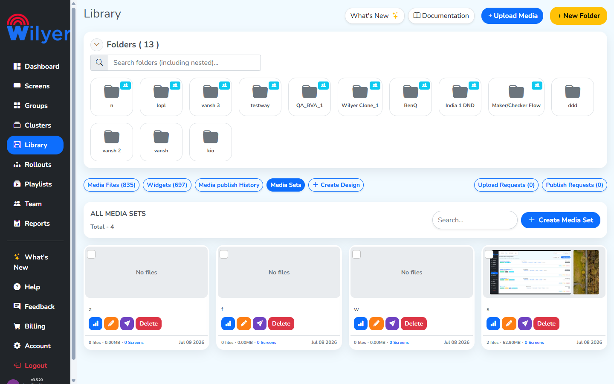
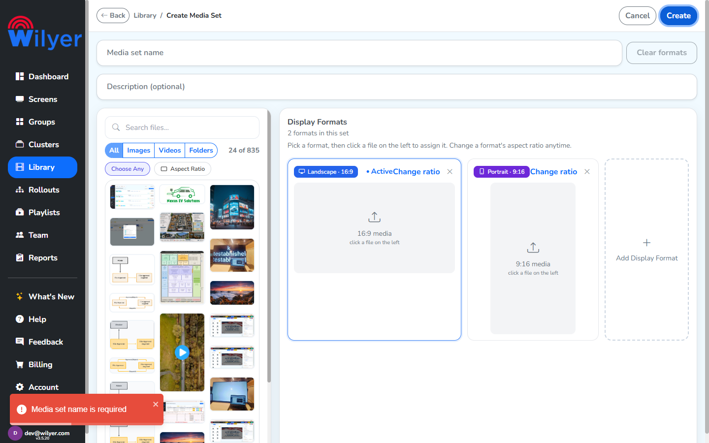
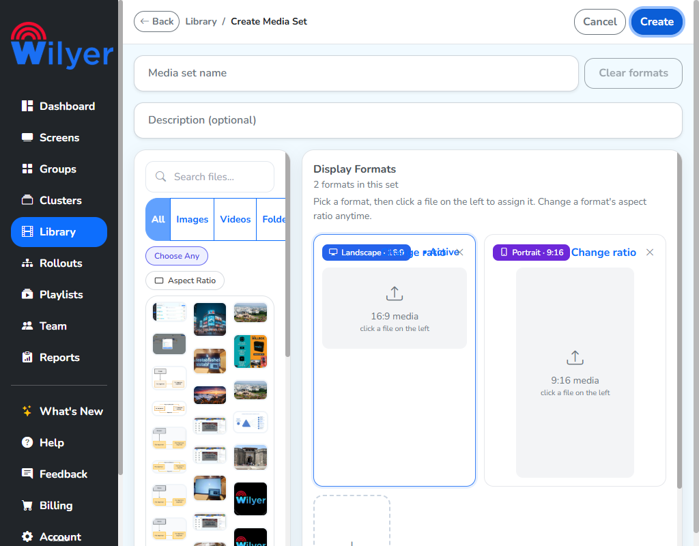

# UI / UX Test Report — Library › Media Sets

**Module:** Library › Media Sets
**Environment:** https://cms2.pocsample.in (build v3.5.20) · API `v3-5api2.pocsample.in/v3/cms/`
**Account:** <admin — see local .env> (test)
**Tested:** 2026-07-09 · exploratory **usability & accessibility** pass (list view, create flow, validation UX)
**Tester:** Aman Kumar (QA)
**Focus:** UI polish, usability, accessibility — with user-friendly enhancement suggestions.

> Scope note: this pass complements the functional bug report (`bug-report-media-sets-20260708.md`, BUG-01 name-length / BUG-02 empty-set). Here the lens is **how it feels to use**, not just what's broken.

---

## Summary

| # | Finding | Area | Severity | Effort |
|---|---------|------|:--------:|:------:|
| UX-01 | Card action icons (Stats / Edit / Share) have no label, tooltip, or `aria-label` | List view · a11y | **High** | Low |
| UX-02 | Validation errors appear only as a bottom-left toast, disconnected from the field | Create/Edit · a11y | **High** | Med |
| UX-03 | Format-card header overlaps at ≤~1024 px; "Active" & "Change ratio" collide with no spacing | Create/Edit · responsive | **Medium** | Low |
| UX-04 | Required "Name" field has no required indicator (no `*`) until submit fails | Create/Edit | **Medium** | Low |
| UX-05 | "Choose Any" filter is misleading — changes what is *shown*, not what can be *assigned* | Create/Edit | **Medium** | Med |
| UX-06 | Empty media sets ("No files", 0.00 MB) exist and are listed with no warning | List view | **Medium** | Low |
| UX-07 | No unsaved-changes guard on Cancel / Back | Create/Edit | Low–Med | Low |
| UX-08 | No character counter / max length on Name & Description | Create/Edit | Low | Low |
| UX-09 | ~199 console warnings emitted on the create page | Hygiene | Low | — |

---

## Findings (detail)

### UX-01 — Icon-only card actions have no accessible name or tooltip · **High**
On each Media Set card the three action controls (Stats bar-chart, Edit pencil, Share paper-plane) are unlabeled SVG buttons.

- **Evidence:** DOM inspection — the action buttons have `title = null`, `aria-label = null`, and no text node.
- **Why it hurts:** A first-time user has to click each icon to learn what it does. A screen-reader user hears only *"button, button, button."* The odd one out — **Delete** — is a full red text button, so the visual hierarchy is inconsistent too.
- **Suggested fix:** Add `aria-label` **and** a hover `title` tooltip to each icon ("View stats", "Edit media set", "Share"). Consider showing the label on hover for sighted users. Keep Delete's treatment, or make all four consistent.

### UX-02 — Errors surface only as a corner toast, not on the field · **High**
Submitting with an empty name shows the toast *"Media set name is required"* in the **bottom-left corner**, while the Name field sits at the **top** of the page.

- **Evidence:** After a failed Create — `aria-invalid = null`, input border unchanged (`rgb(206,212,218)`, the default grey), no inline message near the field, and the field is **not focused** (`document.activeElement !== nameInput`).
- **Why it hurts:** The message is spatially far from the cause; the user must read a transient toast in the opposite corner and map it back. Nothing guides them to the field, and assistive tech gets no `aria-invalid` signal. On a long create page the field may even be scrolled out of view.
- **Suggested fix:** Show an **inline error under the field**, set a red border + `aria-invalid="true"`, **focus and scroll to** the first invalid field. Keep the toast as a secondary cue if desired. Apply the same to the "add files to display formats" and orientation errors.

### UX-03 — Format-card header overlaps / no spacing · **Medium**
The Landscape header packs the ratio badge, the "Active" marker, and the "Change ratio" link into one cramped row.

At ~1024 px the labels overprint into unreadable text:

Even at 1440 px, "Active" and "Change ratio" render with no gap ("ActiveChange ratio"):

Full context at 1024 px:

- **Evidence:** At ~1024 px the three collide into unreadable text ("Landscape · 16:9" / "Change ratio" / "Active" overprint). At 1440 px they no longer overlap, but **"Active" and "Change ratio" render with no space between them** ("ActiveChange ratio") — confirmed by zoom.
- **Why it hurts:** Looks broken at common laptop widths; the run-together text reads as a single nonsense word.
- **Suggested fix:** Give the header `display:flex; gap; flex-wrap:wrap`, and add margin between the Active badge and the Change-ratio link. Verify at 1280/1024/768 px.

### UX-04 — No "required" indicator on the Name field · **Medium**
The Name field placeholder is just *"Media set name"* — no asterisk, no "Required" hint. The field's required-ness is only revealed **after** a failed submit. (See the UX-02 screenshot: the field at the top carries no required marker.)

- **Suggested fix:** Add a visible `*` / "Required" to the label and keep "(optional)" on Description (already present) for a clear contrast.

### UX-05 — "Choose Any" filter is misleading · **Medium**
With **Choose Any** on and Landscape active, selecting a portrait file is still **blocked** with *"That's a portrait file — drop it in the Portrait format."* (See `TC_MS_13`, Fail.)

- **Why it hurts:** "Choose Any" implies *"assign any file here."* In reality it only widens which files are **shown**; orientation is still strictly enforced on assign. Users burn clicks on files they're not allowed to use.
- **Suggested fix:** Either (a) hide non-assignable files instead of just dimming the filter, (b) rename to something honest like "Show all files", plus a hint "Only orientation-matching files can be assigned," or (c) actually allow assign-with-fit/crop.

### UX-06 — Empty media sets are creatable and shown without warning · **Medium**
The list shows two "No files" sets at **0 files · 0.00 MB** (residue of BUG-02 — a set with 0 display formats saves successfully). See the two grey "No files" cards in the UX-01 list screenshot above.

- **Why it hurts:** These sets are unusable downstream (blank playback); nothing on the card flags them as incomplete.
- **Suggested fix:** Block saving a 0-format / 0-file set (client + server), and add an **"Incomplete"** badge on any card missing files so existing ones are recognizable at a glance.

### UX-07 — No unsaved-changes guard · Low–Med
Cancel / Back / breadcrumb navigation discards in-progress edits silently (see `TC_MS_03`). A confirm prompt when leaving with unsaved changes would prevent accidental loss.

### UX-08 — No character counter or max length · Low
Name and Description accept unbounded input (`maxlength = -1`; 300-char name stored — BUG-01). Add `maxlength` + a live "n/100" counter so users see the limit as they type.

### UX-09 — Console noise · Low (hygiene)
The create page logs ~199 warnings on load. Worth a cleanup pass so real errors aren't buried.

---

## Positive UX (working well — keep)
- Helpful inline guidance: *"Pick a format, then click a file on the left to assign it."* and the disabled "Aspect Ratio" toggle carries a `title="Pick a format first"` tooltip — good pattern; extend it to the icon buttons (UX-01).
- Live file search + type chips (Images / Videos / Folders) with a running "24 of 835" count — clear and responsive (`TC_MS_10/11`).
- Aspect-ratio auto-filter ("Showing only 9:16 media — matching the active zone") is a nice touch.
- Delete uses an in-app confirm modal ("This cannot be undone"), not a native dialog — good.
- XSS in names is escaped/rendered as text, not executed.

---

## Enhancement backlog (user-friendly, prioritized)
1. **Label every icon button** — tooltip + `aria-label` (UX-01).
2. **Inline, field-anchored validation** with focus + scroll-to-error (UX-02).
3. **Required-field markers** and per-field character counters (UX-04, UX-08).
4. **Prevent & flag empty sets** — block 0-format save, add an "Incomplete" card badge (UX-06).
5. **Fix the format header layout** and clarify/rename "Choose Any" (UX-03, UX-05).
6. **Unsaved-changes confirmation** on leave (UX-07).
7. **Truncate long names with a `title` tooltip** on cards so hover reveals the full name (ties to BUG-01).

---

## Test coverage added
`tests/MediaSets_UX.spec.js` encodes UX-01, UX-02, UX-04, UX-08 as automated regression checks (accessible-name on card actions, inline error on empty submit, required indicator, name maxlength). See that file to run against cms2.
