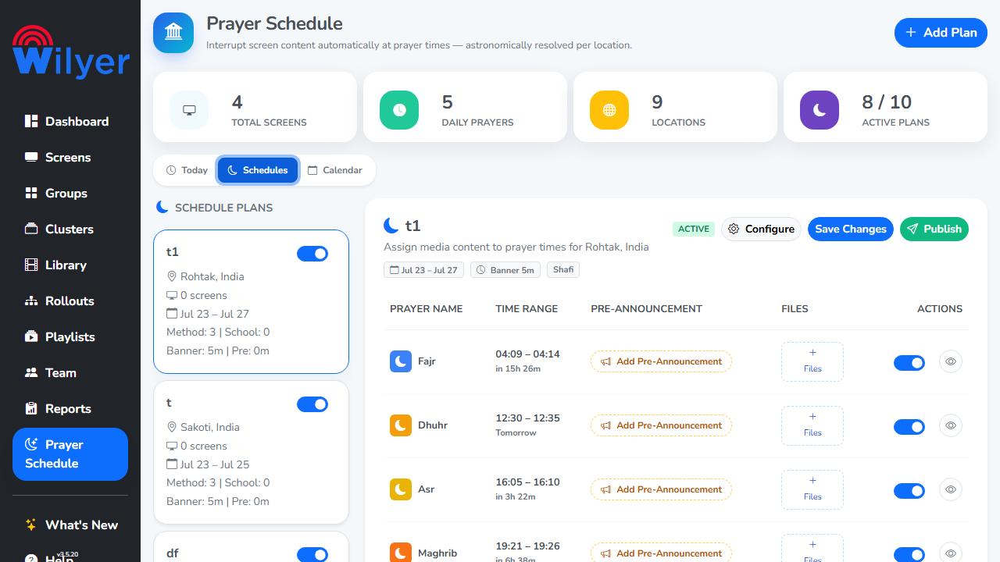
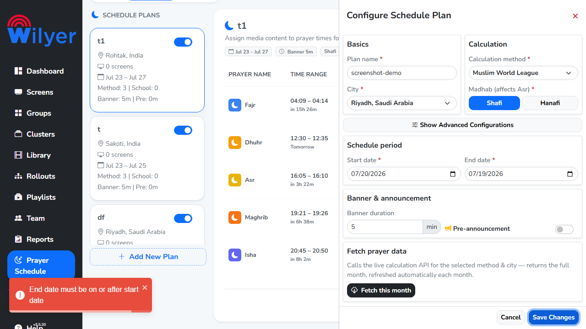
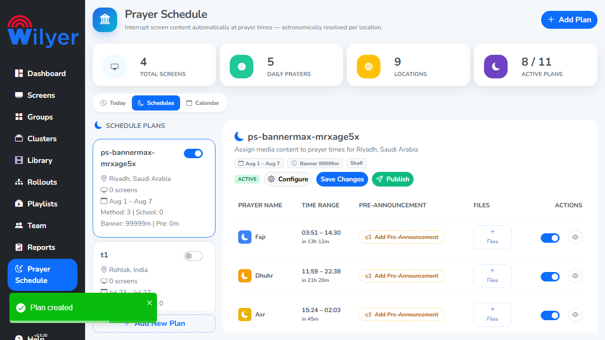
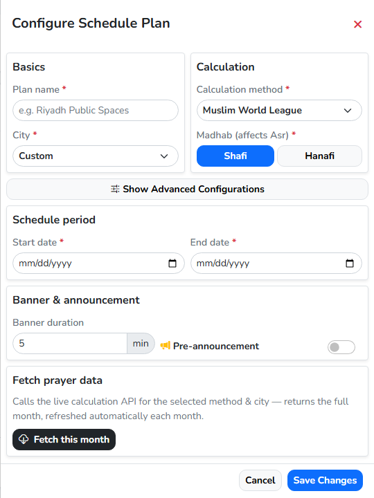
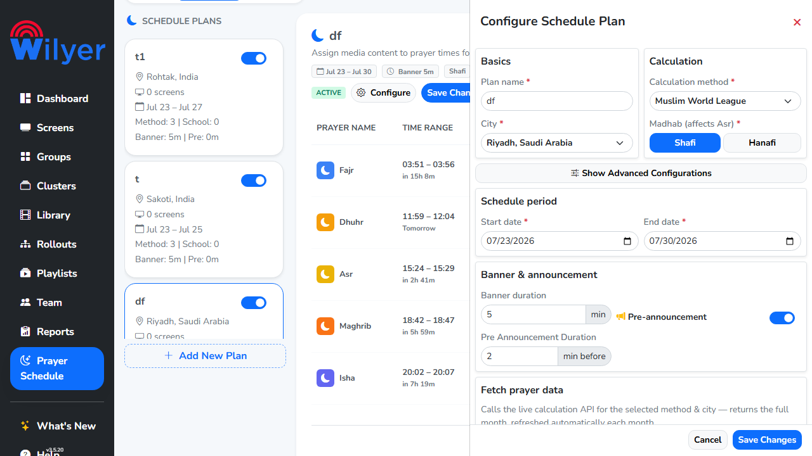
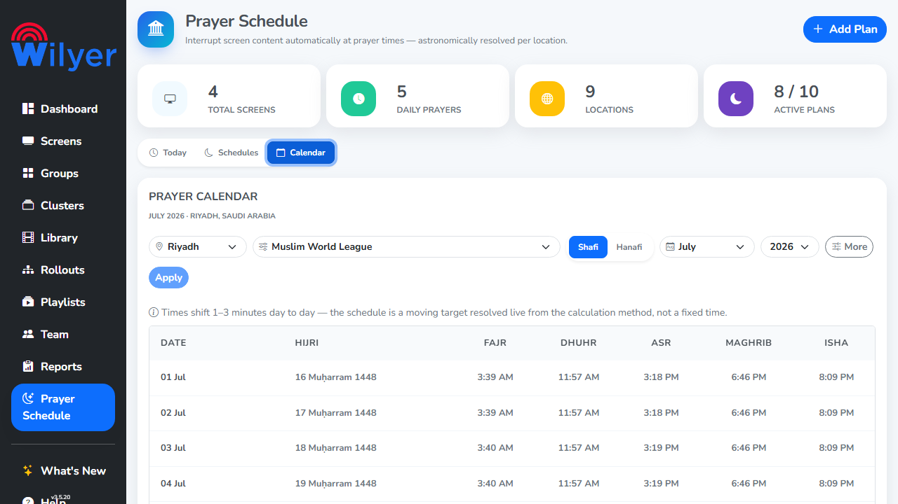

# Prayer Schedule — CRUD & Boundary Test Report (Live)

| | |
|---|---|
| **Module** | Prayer Schedule (`/prayer-schedule`), CMS **v3.5.20** |
| **Environment** | **testdev** · `https://cms.pocsample.in` · Chromium |
| **API backend** | `https://v3-5api.pocsample.in/v3/cms/prayer-schedule/*` |
| **Account** | `dev@wilyer.com` (admin, full access) |
| **Mode** | Destructive **ON** (`CMS_ALLOW_DESTRUCTIVE=true`) — real create/delete |
| **Date** | 2026-07-23 |
| **Tester** | Aman Kumar (QA) |
| **Tooling** | Playwright (TypeScript), Page Object `PrayerSchedulePage.ts` |
| **Spec** | `cms-e2e/tests/prayer-schedule/prayer-schedule.spec.ts` |

---

## 1. Executive summary

CRUD and boundary-value testing was executed **against live testdev data**, driving
the real Configure / Add-New-Plan drawer. **Overall verdict: PASS — 16/16 automated
checks green, 0 console errors, 0 failed/slow API requests.** The app's input
validation is solid (required fields, date-range, XSS-escaping, bounded selects all
behave correctly).

- **All CRUD operations work**: a plan can be created (name + City + schedule period),
  read back in the list, and deleted via the confirm modal. Every plan this run
  created was cleaned up — **testdev was left in its original state** (verified: no
  `ps-*` / `PROBE-*` / XSS test plans remain).
- **Boundary validation is correct** for the surfaces that have it (numeric `min=1`,
  bounded City select, Calendar year 2024–2028).
- **5 issues found**, incl. **1 CRITICAL** (PS-C01 — unbounded banner duration → all-day
  overlapping screen takeover; reproduced) plus 1 accessibility and 3 UX. See §4.
- **Important correction**: the pre-existing spec tested **latitude/longitude fields
  that do not exist** on this surface (location is a bounded City `<select>`, not
  free lat/lng entry). Those phantom tests were removed and boundary coverage was
  rebuilt around the **real** constraints — see §5.

---

## 2. Test execution results

**Run:** `--workers=1 --retries=0`, Chromium · **16 passed** (1 auth setup + 15 cases) ·
**0 failed** · ~1.6 min.

| # | Category | Test | Result |
|---|----------|------|--------|
| 1 | Smoke | Module loads: header + Today/Schedules/Calendar tabs | ✅ |
| 2 | Positive | Today tab renders all 5 prayer cards | ✅ |
| 3 | Positive | Schedules tab exposes Add/Configure/Publish actions | ✅ |
| 4 | Positive | Calendar recomputes rows on Apply (location change) | ✅ |
| 5 | Perf/Health | Loads within budget · clean console · clean API | ✅ |
| 6 | Negative | Empty plan name is **rejected** on save | ✅ |
| 7 | Negative | Banner duration `0` (below min=1) not persisted | ✅ |
| 8 | Negative | End date before start date is **rejected** (clear message) | ✅ |
| 9 | Security | XSS in plan name stored **escaped**, not executed | ✅ |
| 10 | Boundary | City is a **bounded select** — no free-text lat/lng entry | ✅ |
| 11 | Boundary | Banner duration `1` (valid minimum) accepted | ✅ |
| 12 | Boundary | Calendar year `2024` (lower in-range) selectable | ✅ |
| 13 | Boundary | Calendar year `2028` (upper in-range) selectable | ✅ |
| 14 | Boundary | Out-of-range years `2023` / `2029` **not offered** | ✅ |
| 15 | **CRUD** | **Create → read-back → delete** a valid plan | ✅ |

**Module surface under test — Today tab (live clock, next-prayer countdown, 5 prayer cards):**


**Schedules tab — plan list + per-prayer table:**



---

## 3. What the app does correctly (validated live)

| Area | Observed behaviour | Verdict |
|------|--------------------|---------|
| Required fields | New plan needs name + City + Start/End; missing Start date → toast **"Start date is required"**; save blocked | ✅ Correct |
| Date range | Start 2026-07-20 / End 2026-07-19 → blocked + alert **"End date must be on or after start date"** | ✅ Correct |
| Empty name | Save blocked, drawer stays open | ✅ Correct |
| XSS | `<script>alert("xss")</script>` stored & rendered **escaped**; no dialog, no console error | ✅ Correct |
| Location domain | City is a bounded `<select>` (Riyadh, Makkah, Madinah, Jeddah, Dubai, …) | ✅ Correct |
| Numeric min | Banner/Pre-Announcement duration enforce `min=1` | ✅ Correct |
| Year filter | Calendar year picker bounded to 2024–2028 | ✅ Correct |
| CRUD | "Plan created" toast on create; "Are you sure…? [Cancel][Delete]" confirm on delete | ✅ Correct |

**Date-range validation (correct behaviour):** an inverted period (Start 07/20 → End 07/19)
is blocked with a specific alert — **"End date must be on or after start date"**:



---

## 4. UI / UX issues found

### PS-UI-01 — Configure/Add-Plan form fields have no label association *(Accessibility · Medium)*
The drawer's `<label>` elements ("Plan name *", "City *", "Start date *", "Calculation
method *", …) carry **no `for`/`id`** and the inputs have **no `aria-label` /
`aria-labelledby`**. Consequences:
- Screen readers cannot announce which field is which (WCAG **1.3.1**, **3.3.2**, **4.1.2**).
- Clicking a label does not focus its control.
- **Evidence:** Playwright `getByLabel(/plan name/i)` resolves **nothing**; only
  placeholder/structural locators work.
**Fix:** associate each `<label for="…">` with its input `id` (or wrap the control in
the label).

### PS-C01 (was PS-UI-02) — No upper bound on Banner / Pre-Announcement duration *(Functional · **CRITICAL**)*
Both numeric fields enforce `min=1` but have **no `max`** (HTML, client, or server).
**Reproduced 2026-07-23:** a plan created with **Banner duration = 99999** is **accepted
and persisted**, created **ACTIVE** and publishable — the per-prayer Time Range balloons
to overlapping multi-hour windows (Fajr 03:51–14:30, Dhuhr 11:59–22:38, Asr 15:24–02:03),
i.e. an all-day screen takeaway. Live data already shows plan **"lal kurti"** with
**Banner: 350m | Pre: 200m** (~6-hour banner). Full write-up:
`reports/prayer-schedule-bug-PS-C01-20260723.md`.
**Fix:** hard `max` + server validation; cross-field guard `banner ≤ gap to next prayer`;
confirm above a soft threshold; mirror on Pre-Announcement duration.



### PS-UI-03 — Add-New-Plan leaves Start/End dates empty; Configure pre-fills them *(UX inconsistency · Low–Medium)*
Opening **Add New Plan** shows **blank** Start/End dates, so a first save fails with
"Start date is required". Editing an **existing** plan pre-fills today / +7 days.
**Fix:** default new plans to today / +7 days for consistency with the edit flow.

**Add New Plan — Start/End blank (`mm/dd/yyyy`), City shows the `Custom` placeholder:**



**Configure existing plan — dates pre-filled (07/23 → 07/30), pre-announcement field shown:**



### PS-UI-04 — "Delete plan" is unreachable while Configure is open *(UX / layering · Low)*
"Delete plan" lives in the plan-**detail** panel. Opening the **Configure** offcanvas
floats a modal **over** it and intercepts the click, so a user who opens Configure to
delete must close it first. (This also caused an initial automation click-timeout.)
**Fix:** place Delete inside the Configure drawer footer (its natural home).

### PS-UI-05 — New-plan City defaults to a `__custom__` placeholder value *(Cosmetic · Low)*
The City select's default selected option is a non-city sentinel value
(`__custom__`) rather than a prompt like "Select a city". Validated on save (good),
but the raw sentinel is exposed in the DOM.
**Fix:** use an explicit disabled "Select a city" placeholder option.

> **Related (pre-existing, not re-tested this cycle):** **PS-N01** — coordinate-less
> plan stays ACTIVE with a stuck "Location is required" toast and stale times
> (`reports/prayer-schedule-bug-PS-N01-20260714.md`). The regression guard
> `prayer-schedule-coordinateless.spec.ts` remains available via `CMS_PS_BROKEN_PLAN`.

---

## 5. Test-suite corrections (accuracy of coverage)

The prior spec was authored from a 2026-07-02 capture and asserted against a surface
that **no longer matches reality**. Re-verified live and corrected:

| Prior (incorrect) | Reality (verified 2026-07-23) | Action |
|-------------------|-------------------------------|--------|
| `latInput` / `longInput` spinbuttons; "lat > 90" / "long > 180" boundary tests | **No lat/long fields exist** — location is a bounded City `<select>` | **Removed** phantom tests; added "City is a bounded select" boundary |
| `cityInput` free-text field; CRUD typed "Delhi" | City is a `<select>` of predefined locations | Switched to `citySelect` + real option selection |
| `planNameInput` via `/plan name/i` role/label | Placeholder is `"e.g. Riyadh Public Spaces"`; labels not associated | Selector fixed to placeholder |
| CRUD created plan without a schedule period | Start/End dates are **required** on create | Create now fills the period (`fillRequiredPlanBasics`) |
| Delete via Configure drawer | Delete lives in the detail panel (Configure covers it) | Delete flow fixed; toast-proof "plan absent" assertion added |
| Pre-Announcement duration min tested on new plan | Field not rendered until pre-announcement enabled | Removed (banner covers the min=1 boundary) |

Drawer structure (offcanvas, label→control mapping) is now documented inline in
`pages/PrayerSchedulePage.ts` with a "RE-VERIFIED 2026-07-23" note.

---

## 6. How to reproduce

```bash
cd cms-e2e
# Read-only (destructive cases auto-skip):
npx playwright test --config=playwright.config.ts prayer-schedule.spec.ts --project=chromium

# Full CRUD + boundary against real testdev data (create/delete):
CMS_ALLOW_DESTRUCTIVE=true npx playwright test --config=playwright.config.ts \
  prayer-schedule.spec.ts --project=chromium --workers=1
```

**Data safety:** write cases operate on throwaway `Add New Plan` drafts with unique
names and self-clean (create-then-delete). No pre-existing plan is modified or deleted.

---

## 7. Recommendation

Ship-safe from a functional standpoint — CRUD and validation are correct. Prioritise
**PS-UI-01** (accessibility) and **PS-UI-02** (missing duration max) for the next
sprint; **PS-UI-03/04/05** are low-effort polish.

---

## 8. Visual evidence

All captures are live from `cms.pocsample.in` (testdev), Chromium @ 1280×720,
2026-07-23. Full-resolution PNGs in `reports/prayer-schedule-crud-images/`.

| # | File | Shows |
|---|------|-------|
| 1 | `01-plan-list.png` | Schedules tab — plan cards + per-prayer table |
| 2 | `02-add-new-plan-blank-dates.png` | Add New Plan — **blank Start/End dates**, City `Custom` (PS-UI-03/05) |
| 3 | `03-daterange-validation.png` | Inverted range blocked — **"End date must be on or after start date"** |
| 4 | `04-configure-prefilled-and-delete-covered.png` | Configure existing — **pre-filled dates** + pre-announcement field (PS-UI-03) |
| 5 | `05-today-tab.png` | Today tab — 5 prayer cards, next-prayer countdown |
| 6 | `06-calendar-tab.png` | Calendar tab — computed month table |

**Calendar tab (month computation):**


